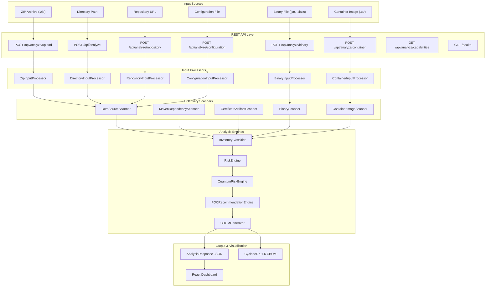

# ECDAT
Enterprise Cryptographic Discovery & Analysis Tool (ECDAT) — SIH 2026

## Project Description
ECDAT is an enterprise-grade tool for discovering and analyzing cryptographic implementations across software systems. This project is developed for SIH 2026.

## Technology Stack

### Backend
- Java 21
- Spring Boot 4.1.1
- Maven
- Spring Web (MVC)
- Spring Actuator

### Frontend
- React 19.2.8
- TypeScript
- Vite 8.2.2

## Getting Started

### Backend
```bash
cd backend
mvn spring-boot:run
```
The backend will start on `http://localhost:8080`

### Frontend
```bash
cd frontend
npm run dev
```
The frontend will start on `http://localhost:5173`

## Current Implementation Status

### Completed (Foundation Phase)
- ✅ Backend Spring Boot application with proper package structure (`com.ecdat.backend`)
- ✅ Health endpoint (`GET /health`) returning `{"status":"UP"}`
- ✅ CORS configuration for local development
- ✅ Frontend React + TypeScript + Vite application
- ✅ Frontend page displaying ECDAT title and subtitle
- ✅ Frontend connectivity to backend health endpoint
- ✅ Backend tests (context loading test)
- ✅ Frontend build verification
- ✅ Git configuration (.gitignore)

### Completed (Phase 1 - Crypto Discovery)
- ✅ JavaParser-based AST analysis engine
- ✅ Detection of AES, RSA, ECDSA, ECDH, SHA-256, SHA-1, SHA-512, MD5, TLS
- ✅ Key size extraction for RSA
- ✅ Purpose detection (encryption, signing, key agreement, etc.)
- ✅ Confidence scoring (HIGH/MEDIUM/LOW)
- ✅ Comprehensive test suite

### Completed (Phase 2 - Risk Engine)
- ✅ Rule-based risk assessment engine
- ✅ Risk scoring model (0-100 prototype methodology)
- ✅ Risk level classification (LOW/MEDIUM/HIGH/CRITICAL)
- ✅ Quantum risk classification (NONE/LOW/HIGH)
- ✅ Explainable risk factors with detailed reasoning
- ✅ Algorithm-specific risk rules (RSA, ECDSA, ECDH, AES, hash functions, TLS)
- ✅ Purpose-aware risk assessment
- ✅ Confidence integration in risk evaluation
- ✅ Comprehensive risk engine test suite

### Completed (Phase 3 - PQC Recommendation Engine)
- ✅ Purpose-aware PQC recommendation engine
- ✅ Algorithm-to-purpose mappings (RSA/ECDSA → ML-DSA, ECDH → ML-KEM)
- ✅ Alternative algorithm support (SLH-DSA for digital signatures)
- ✅ Migration priority classification (LOW/MEDIUM/HIGH/CRITICAL)
- ✅ Recommendation status classification (RECOMMENDED/CONDITIONAL/NEEDS_ANALYSIS/NOT_REQUIRED)
- ✅ Uncertainty handling for low-confidence findings
- ✅ Comprehensive migration considerations
- ✅ Risk Engine integration for priority determination
- ✅ Comprehensive PQC recommendation test suite
### Completed (Phase 4 - CBOM Generation)
- ✅ CycloneDX 1.6-aligned CBOM document model with custom cryptographic properties (not schema-compliant)
- ✅ Structured cryptographic asset representation with custom `cryptoProperties` structure
- ✅ End-to-end pipeline integration (`CryptoFinding` → `RiskAssessment` → `PQCRecommendation` → CBOM)
- ✅ Source code traceability (source file, line number, code evidence, detection confidence)
- ✅ Embedded risk information (score, level, quantum risk, risk factors, Mosca calculations)
- ✅ Embedded PQC recommendations (status, recommended/alternative algorithms, priority, rationale, considerations)
- ✅ Custom ECDAT metadata properties (`ecdat:risk_assessment_version`, `ecdat:confidence_preserved`)
- ✅ Deterministic and robust JSON serialization
- ✅ Comprehensive CBOM test suite (18 tests covering serialization, structure, and field preservation)
- ⚠️ **Note**: CBOM format is CycloneDX-aligned but not schema-compliant. See `CBOM_AUDIT_FINDINGS.md` for detailed compatibility analysis and recommendations.

### Completed (Phase 5 - Backend API / Pipeline Integration)
- ✅ Dedicated pipeline orchestration service (`AnalysisService`)
- ✅ Integrated pipeline flow: Discovery → Risk Engine → PQC Recommendation Engine → CBOM Generation
- ✅ REST API endpoints (`POST /api/analyze` for directory paths, `POST /api/analyze/upload` for zip archives)
- ✅ Preservation of health endpoint (`GET /health`)
- ✅ Strong security controls: path traversal validation, Zip Slip mitigation, zip bomb expansion bounds, upload limits
- ✅ Safe temporary resource handling with guaranteed cleanup
- ✅ Global exception handler (`@RestControllerAdvice`) returning structured error responses with zero stack traces
- ✅ Comprehensive API and service integration test suite

### Completed (Phase 6 - React Dashboard / Frontend Integration)
- ✅ Modern cybersecurity React + TypeScript + Vite dashboard
- ✅ Direct backend REST API client service layer (`POST /api/analyze`, `POST /api/analyze/upload`, `GET /health`)
- ✅ Configurable backend connection (`VITE_API_BASE_URL` with fallback to `http://localhost:8080`)
- ✅ Executive KPI summary cards with actual backend counters
- ✅ Visual risk distribution bar & algorithm posture analysis
- ✅ Interactive findings table with search, risk/quantum/purpose filters, and deep row inspection
- ✅ Finding details modal displaying full evidence chain (Finding → Source File:Line → AST Evidence → Risk → PQC)
- ✅ Dedicated PQC recommendations section aligned with NIST FIPS 203 (ML-KEM), FIPS 204 (ML-DSA), FIPS 205 (SLH-DSA)
- ✅ CycloneDX 1.6 CBOM component inspector and raw JSON viewer with clipboard copy and file export
- ✅ Source traceability view for explainability during hackathon demonstrations
- ✅ Honest pipeline loading indicator and friendly error alerts
- ✅ Comprehensive frontend Vitest test suite

### Completed (Phase 7 - Crypto Inventory Expansion & Asset Classification)
- ✅ Dedicated enterprise inventory subsystem (`com.ecdat.backend.inventory`)
- ✅ Structured inventory assets (`CryptoAsset`, `CryptoInventory`) with aggregated category, lifecycle, and usage breakdowns
- ✅ Asset classification taxonomy (`ENCRYPTION`, `DIGITAL_SIGNATURE`, `KEY_ESTABLISHMENT`, `HASHING`, `TLS_PROTOCOL`, `CERTIFICATE`, `KEY_GENERATION`, `UNKNOWN`)
- ✅ Evidence-based usage categorization (`DIRECT_USAGE`, `INDIRECT_CONFIGURATION`, `DEPENDENCY_PRESENCE`, `UNKNOWN`)
- ✅ Lifecycle status classification (`ACTIVE`, `DEPRECATED`, `UNKNOWN`)
- ✅ Honest enterprise context boundaries (`BusinessCriticality.UNKNOWN` and `DataSensitivity.UNKNOWN` default without fabrication)
- ✅ CycloneDX 1.6-aligned CBOM integration with custom cryptographic properties (not schema-compliant)
- ✅ End-to-end pipeline integration preserving Phase 2 risk scores and Phase 3 PQC mappings
- ✅ React dashboard inventory filtering, lifecycle badges, and detailed classification inspection
- ✅ Comprehensive inventory classification test suite with negative tests (104 backend tests total)

### Completed (Phase 4 - Multi-Input Architecture Foundation)
- ✅ Unified input type enumeration (`AnalysisInputType`) with clear supported/roadmap status
- ✅ Normalized analysis request model (`AnalysisInput`) supporting multiple input sources
- ✅ Normalized artifact representation (`DiscoveredArtifact`) for cross-input consistency
- ✅ Extensible input processor interface (`AnalysisInputProcessor`)
- ✅ Implemented processors: `ZipInputProcessor`, `SourceFileInputProcessor`, `DirectoryInputProcessor`, `RepositoryInputProcessor`, `ConfigurationInputProcessor`, `BinaryInputProcessor`, `ContainerInputProcessor`
- ✅ Processor registry with capability discovery (`AnalysisInputProcessorRegistry`)
- ✅ Capabilities endpoint (`GET /api/analyze/capabilities`) returning supported/roadmap status
- ✅ AnalysisResponse enriched with input metadata (inputType, inputName, inputSource)
- ✅ Frontend TypeScript types for multi-input architecture
- ✅ Frontend Scan Project UI with all input types available
- ✅ Frontend API service with capability discovery and fallback capabilities
- ✅ Comprehensive backend tests for input processing architecture (Zip Slip, archive limits, security)
- ✅ Frontend API tests for capability discovery and all input endpoints
- ✅ Bug fix: InventoryClassifier now handles JAVA_AST_MAVEN and JAVA_AST_* source types correctly using startsWith()
- ✅ Bug fix verified: Certificate RSA key size uses modulus bit length (rsaKey.getModulus().bitLength())
- ✅ Frontend UI update: Directory Path input now includes configuration requirement note

### Completed (Phase 5 - Repository URL Scanning)
- ✅ URL validation (`RepositoryUrlValidator`) with HTTPS enforcement, credential rejection, and normalization
- ✅ SSRF protection (`SsrfProtection`) with DNS resolution, IP address validation, and private range blocking
- ✅ Secure Git acquisition (`RepositoryAcquisition`) via ProcessBuilder with shallow clone and timeout
- ✅ Resource limits configuration (clone timeout, max repo size, file count, file size)
- ✅ Repository-specific error types (`RepositoryAnalysisException`) with structured error codes
- ✅ `RepositoryInputProcessor` implementing the multi-input architecture
- ✅ Registry updated to register `RepositoryInputProcessor`
- ✅ `AnalysisInputType.REPOSITORY_URL` supported flag set to `true`
- ✅ New API endpoint `POST /api/analyze/repository` using `AnalysisService.analyze()`
- ✅ Frontend Scan Project UI enabled Repository URL card with input field
- ✅ Frontend API service updated to call new repository endpoint
- ✅ Security tests (URL validation, SSRF with DNS/redirects, Git detection)
- ✅ Workspace cleanup tests
- ✅ Backend regression tests: 334/334 passed (1 skipped)
- ✅ Frontend regression tests: 32/32 passed
- ✅ Production frontend build successful

### Completed (Phase 6 - Configuration File Scanning)
- ✅ Configuration file input processor (`ConfigurationInputProcessor`) supporting .properties, .yml, .yaml, .xml, .conf, .cfg, .ini
- ✅ Configuration file validation with format checking and size limits (10 MB max)
- ✅ Configuration finding model (`ConfigurationFinding`) for metadata extraction
- ✅ API endpoint `POST /api/analyze/configuration` for configuration file upload
- ✅ Frontend Scan Project UI enabled Configuration File card with file upload
- ✅ Frontend API service updated to call configuration endpoint
- ✅ Security tests for configuration file validation
- ✅ Configuration analysis integration tests

### Completed (Phase 7 - Binary File Scanning)
- ✅ Binary scanner infrastructure (`BinaryScanner`) with JAR and CLASS file support
- ✅ JAR binary scanner (`JarBinaryScanner`) for archive analysis
- ✅ CLASS bytecode analyzer (`BytecodeAnalyzer`) for constant pool inspection
- ✅ Binary analysis limits configuration (file size, entry count, processing time)
- ✅ Binary input processor (`BinaryInputProcessor`) for .jar and .class files
- ✅ API endpoint `POST /api/analyze/binary` for binary file upload
- ✅ Frontend Scan Project UI enabled Binary File card with file upload
- ✅ Frontend API service updated to call binary endpoint
- ✅ Security tests for binary file validation and limits
- ✅ Binary scanner integration tests with crypto fixture JARs
- ✅ Bytecode analysis tests for cryptographic constant detection

### Completed (Phase 8 - Container Image Scanning)
- ✅ Container image scanner (`ContainerImageScanner`) for static Docker/OCI analysis
- ✅ Docker manifest reader (`DockerManifestReader`) for image metadata parsing
- ✅ Layer extractor (`LayerExtractor`) with tar extraction and Zip Slip protection
- ✅ Artifact discovery (`ArtifactDiscovery`) for layer content classification
- ✅ Container analysis limits (layer count, extraction size, resource bounds)
- ✅ Container input processor (`ContainerInputProcessor`) for .tar, .tar.gz, .tgz archives
- ✅ API endpoint `POST /api/analyze/container` for container image upload
- ✅ Frontend Scan Project UI enabled Container Image card with file upload
- ✅ Frontend API service updated to call container endpoint
- ✅ Security tests for container validation, layer limits, and path traversal
- ✅ Container scanner integration tests with real Docker image archives
- ✅ NO Docker daemon required - pure static analysis
- ✅ NO container code execution - safe analysis environment

### Not Yet Implemented
- ❌ Authentication and authorization (basic UI login screen exists but no backend auth)
- ❌ Database persistence (all data is in-memory per request)
- ❌ Automated source-code migration (advisory recommendations only)
- ❌ HSM/KMS integration and discovery
- ❌ Live infrastructure scanning and runtime cryptographic discovery
- ❌ Cloud service cryptographic inventory (AWS KMS, Azure Key Vault, GCP KMS)
- ❌ Real-time quantum threat horizon monitoring
- ❌ Automated PQC migration tooling and code generation

## Testing

### Backend Tests
```bash
cd backend
mvn clean test
```

### Frontend Tests & Build
```bash
cd frontend
npm test
npm run build
```

## Architecture Overview



## Project Structure
```
ECDAT/
├── backend/          # Spring Boot backend
│   ├── src/main/java/com/ecdat/backend/
│   │   ├── cbom/                    # CBOM generation
│   │   ├── controller/              # REST API controllers
│   │   ├── dto/                     # Data transfer objects
│   │   ├── input/                   # Input processors & security
│   │   ├── inventory/               # Asset classification
│   │   ├── pqc/                     # PQC recommendation engine
│   │   ├── risk/                    # Risk assessment engine
│   │   ├── scanner/                 # Discovery scanners
│   │   └── service/                 # Business logic services
│   └── src/test/                    # Comprehensive test suite
├── frontend/        # React + TypeScript + Vite frontend
│   ├── src/components/              # UI components
│   ├── src/services/                # API client
│   ├── src/types/                   # TypeScript types
│   └── src/test/                    # Frontend tests
├── test-target/     # Sample Java project for testing
├── test-fixtures/   # Test data and fixtures
├── docs/            # Documentation
└── README.md
```

## Supported Input Types

ECDAT supports multiple input sources for cryptographic analysis:

| Input Type | Supported | API Endpoint | File Formats | Notes |
|------------|-----------|---------------|---------------|-------|
| **ZIP Archive** | ✅ Yes | `POST /api/analyze/upload` | .zip | Project archives with source code |
| **Directory Path** | ✅ Yes | `POST /api/analyze` | Local directory | Requires security configuration |
| **Repository URL** | ✅ Yes | `POST /api/analyze/repository` | HTTPS Git URLs | Public repositories only, SSRF protected |
| **Configuration File** | ✅ Yes | `POST /api/analyze/configuration` | .properties, .yml, .yaml, .xml, .conf, .cfg, .ini | 10 MB max file size |
| **Binary File** | ✅ Yes | `POST /api/analyze/binary` | .jar, .class | Static bytecode analysis, no execution |
| **Container Image** | ✅ Yes | `POST /api/analyze/container` | .tar, .tar.gz, .tgz | Static Docker/OCI analysis, no daemon required |

## Current Limitations

### Discovery Scope
- **Software-Centric Discovery**: ECDAT focuses on static analysis of software artifacts (source code, binaries, configurations). It does not perform live infrastructure scanning or runtime cryptographic discovery.
- **Language Support**: Currently optimized for Java source code analysis. Other languages are not supported.
- **Static Analysis Boundaries**: Cannot resolve cryptographic algorithms constructed dynamically at runtime (marked as `UNKNOWN` with `LOW` confidence).
- **Dependency Presence vs Usage**: Library/dependency presence in build files is not treated as proof of cryptographic usage.

### Infrastructure & Cloud
- **No HSM/KMS Integration**: Does not discover cryptographic assets in Hardware Security Modules or Key Management Services.
- **No Cloud Service Discovery**: No integration with AWS KMS, Azure Key Vault, GCP KMS, or other cloud cryptographic services.
- **No Live Runtime Analysis**: Cannot discover cryptographic operations in running applications or network traffic.

### Quantum Risk Assessment
- **Prototype Methodology**: Risk scores use an ECDAT prototype heuristic (0-100), not official NIST/CVSS scoring formulas.
- **Threat Horizon Assumptions**: Quantum threat timelines are configurable but not based on real-time threat intelligence.
- **Mosca's Theorem Implementation**: Quantum risk calculations use a simplified implementation of Mosca's theorem (X+Y > Z) without complex migration modeling.

### Recommendations vs Migration
- **Advisory Only**: PQC recommendations are advisory suggestions for migration planning. ECDAT does not automatically modify source code, replace certificates, or enforce cryptographic policies.
- **No Automated Migration**: No code generation, certificate renewal, or automated migration tooling.
- **Manual Implementation Required**: Organizations must manually implement recommended PQC algorithms based on guidance.

### Security & Access Control
- **No Authentication**: Basic UI login screen exists but has no backend authentication or authorization implementation.
- **No Authorization**: No role-based access control or user permissions.
- **No Audit Logging**: No audit trail for analysis requests or results.
- **In-Memory Only**: All analysis data is stored in-memory per request with no database persistence.

### Operational Constraints
- **Synchronous Processing**: API executes analysis synchronously. Large codebases may experience higher latency.
- **Single-Tenant**: Designed for single-tenant operation without multi-tenancy support.
- **No Scalability**: No horizontal scaling or distributed processing capabilities.

## Feature Status Summary

### IMPLEMENTED ✅
- **Core Discovery**: Java AST scanning, Maven dependency scanning, certificate scanning
- **Binary Analysis**: JAR and CLASS bytecode analysis with constant pool inspection
- **Container Analysis**: Static Docker/OCI image analysis with layer extraction
- **Configuration Analysis**: Multi-format configuration file parsing (.properties, .yml, .yaml, .xml, .conf, .cfg, .ini)
- **Risk Assessment**: Rule-based risk engine with quantum risk classification
- **PQC Recommendations**: Purpose-aware post-quantum algorithm recommendations
- **CBOM Generation**: CycloneDX 1.6-aligned cryptographic bill of materials (not schema-compliant)
- **Multi-Input Architecture**: Extensible input processor system with 6 input types
- **Repository Scanning**: Secure Git repository cloning with SSRF protection
- **Inventory Classification**: Enterprise asset categorization and lifecycle management
- **React Dashboard**: Modern cybersecurity UI with multiple views and filters
- **REST API**: Comprehensive API with 8 endpoints for all input types
- **Security Controls**: Zip Slip protection, path traversal validation, resource limits
- **Test Coverage**: 334 backend tests (1 skipped), 32 frontend tests

### PARTIALLY IMPLEMENTED ⚠️
- **Authentication**: UI login screen exists but no backend auth implementation
- **Quantum Risk Engine**: Basic Mosca's theorem implementation without advanced migration modeling
- **CBOM Schema**: CycloneDX 1.6-inspired structure with custom properties (not schema-compliant)

### PLANNED / FUTURE 📋
- **Database Persistence**: Store analysis results and historical data
- **Authentication & Authorization**: Real user authentication with RBAC
- **HSM/KMS Integration**: Discover cryptographic assets in hardware security modules
- **Cloud Service Discovery**: AWS KMS, Azure Key Vault, GCP KMS integration
- **Live Infrastructure Scanning**: Runtime cryptographic discovery
- **Automated Migration**: Code generation and automated PQC migration tooling
- **Multi-Language Support**: Extend beyond Java to other programming languages
- **Real-Time Threat Monitoring**: Dynamic quantum threat horizon updates
- **Audit Logging**: Comprehensive audit trail for compliance
- **Multi-Tenancy**: Support for multiple organizations and projects
- **Distributed Processing**: Horizontal scaling for large codebases

## Crypto Discovery

The first phase of the Enterprise Cryptographic Discovery & Analysis Tool (ECDAT) relies on a custom static analysis engine built on JavaParser.

*   **Java Source Scanning**: Recursively scans `.java` files within a designated target directory. Malformed files log an error and are skipped without terminating the scan.
*   **JavaParser AST Analysis**: Uses Abstract Syntax Trees to identify cryptographic API usages (e.g., `MethodCallExpr` targeting `getInstance`). This provides higher accuracy than standard regex scanning and enables context extraction, such as mapping `initialize()` calls back to `KeyPairGenerator` instances to extract key sizes.
*   **Supported APIs**: Currently detects Java Cryptography Architecture (JCA) APIs including AES, RSA, ECDSA, ECDH, Hashing (SHA-256, SHA-1, SHA-512, MD5), and TLS.
*   **Evidence Collection**: Generates a `CryptoFinding` containing the detected algorithm, line number, relative file path, explicit code evidence, and confidence rating.
*   **Limitations**: 
    *   Static analysis may not resolve cryptographic algorithms whose values are generated dynamically at runtime. These are marked as `UNKNOWN` with a `LOW` confidence score.
    *   Library/dependency presence is not treated as proof of cryptographic usage. Detection is strictly bound to source code AST evaluation.

## Risk Engine

The Risk Engine provides explainable, rule-based risk assessment for cryptographic findings identified by the discovery engine.

### Risk Assessment Model

*   **Risk Score**: 0–100 prototype methodology (not an official NIST scoring formula)
*   **Risk Levels**: LOW (0–24), MEDIUM (25–49), HIGH (50–74), CRITICAL (75–100)
*   **Quantum Risk**: NONE, LOW, HIGH
*   **Risk Factors**: Individual contributions with name, score, and explanation
*   **Confidence Integration**: LOW confidence findings receive adjusted risk assessments
*   **Score Breakdown**: Explainable component-by-component score attribution with methodology note

### ECDAT Risk Score Methodology

The ECDAT Risk Score is a **heuristic assessment** (not NIST/CVSS) that combines multiple weighted factors to produce a 0–100 risk score. The scoring is deterministic and fully explainable.

#### Scoring Formula

```
Total Score = Σ (Algorithm Factors + Key Size Factors + Quantum Factors + Business Context Factors)
```

The score is capped at 100 and floored at 0.

#### Factor Categories and Weights

**Algorithm Strength Factors:**
- Public-key cryptography (RSA, ECDSA, ECDH): +5 points
- Symmetric cryptography (AES): +3 points
- Modern hash (SHA-256, SHA-512): +10 points
- Weak hash (SHA-1): +60 points
- Broken hash (MD5): +85 points
- Cryptographic concern (algorithm-specific base): +5 to +30 points

**Quantum Vulnerability Factors:**
- Quantum-vulnerable algorithms (RSA, ECDSA, ECDH): +20 points
- Quantum-resistant algorithms (AES, SHA-256, SHA-512): +5 points

**Key Size Factors:**
- RSA < 1024 bits: +40 points
- RSA 1024-2047 bits: +10 points
- RSA 2048 bits: 0 points
- RSA > 2048 bits: -5 points
- RSA unknown key size: +15 points
- AES-256: -5 points
- AES-128: +5 points
- AES unknown key size: +10 points

**Business Context Factors:**
- Data sensitivity (HIGHLY_SENSITIVE): +15 points
- Data sensitivity (CONFIDENTIAL): +10 points
- Data sensitivity (INTERNAL): +5 points
- Data sensitivity (PUBLIC): 0 points
- Business criticality (CRITICAL): +15 points
- Business criticality (HIGH): +10 points
- Business criticality (MEDIUM): +5 points
- Business criticality (LOW): 0 points

**Usage Context Factors:**
- Digital signature purpose: +2 points
- Key generation purpose: +2 points
- Key agreement purpose: +2 points

**Algorithm Status Factors:**
- Deprecated algorithm (SHA-1, MD5): +10 to +15 points

#### Example Calculation

**RSA-2048 with HIGH business context:**
```
PUBLIC_KEY_CRYPTOGRAPHY: +5
QUANTUM_VULNERABILITY: +20
CRYPTOGRAPHIC_CONCERN: +25
KEY_SIZE (2048 bits): 0
DATA_SENSITIVITY (HIGHLY_SENSITIVE): +15
BUSINESS_CRITICALITY (CRITICAL): +15
─────────────────────────────────
Total: 80 → Risk Level: HIGH
```

**MD5 with LOW business context:**
```
BROKEN_HASH: +85
DEPRECATED_ALGORITHM: +15
DATA_SENSITIVITY (PUBLIC): 0
BUSINESS_CRITICALITY (LOW): 0
─────────────────────────────────
Total: 100 → Risk Level: CRITICAL (capped)
```

**AES-256 with MEDIUM business context:**
```
SYMMETRIC_CRYPTOGRAPHY: +3
CRYPTOGRAPHIC_CONCERN: +5
KEY_SIZE (AES-256): -5
QUANTUM_RESISTANCE: +5
DATA_SENSITIVITY (INTERNAL): +5
BUSINESS_CRITICALITY (MEDIUM): +5
─────────────────────────────────
Total: 18 → Risk Level: LOW
```

#### Important Notes

*   **Heuristic Methodology**: This is an ECDAT prototype heuristic, not an official NIST or CVSS scoring formula.
*   **Deterministic**: Same input always produces the same score.
*   **Explainable**: Every score includes a full breakdown of contributing factors.
*   **Business Context**: When provided, business criticality and data sensitivity adjust the score by ±15 points.
*   **Score Capping**: Scores are capped at 100 (CRITICAL) and floored at 0 (LOW).

### Risk Scoring Rules

#### Public-Key Cryptography (RSA, ECDSA, ECDH)
*   **Quantum Risk**: HIGH - vulnerable to future cryptographically relevant quantum attacks
*   **Base Risk**: Elevated due to post-quantum migration requirements
*   **Key Size Impact**: Unknown or small key sizes increase risk significantly
*   **Purpose Awareness**: Different considerations for digital signatures vs key agreement

#### Symmetric Cryptography (AES)
*   **Quantum Risk**: LOW - more quantum-resistant than public-key cryptography
*   **Key Size Impact**: AES-256 considered very secure, AES-128 has moderate quantum concerns
*   **Base Risk**: Generally LOW when used with proper key sizes and modes

#### Hash Functions
*   **SHA-256/SHA-512**: LOW risk, modern hash functions
*   **SHA-1**: HIGH risk due to cryptographic weaknesses
*   **MD5**: CRITICAL risk due to collision vulnerabilities

#### TLS Protocols
*   **TLS 1.3**: LOW risk - most current and secure version
*   **TLS 1.2**: LOW to MEDIUM risk - depends on cipher suite configuration
*   **Assessment Limitations**: Current scanner does not analyze cipher suites, certificates, or key exchange methods

### Important Notes

*   **Prototype Methodology**: The risk score is an ECDAT prototype methodology and is not an official NIST scoring formula.
*   **Explainable Assessment**: Every risk assessment includes detailed factors and human-readable reasons.
*   **Research Basis**: Aligned with NIST's crypto-agility guidance and PQC migration project principles for cryptographic inventories and risk management.
*   **Consistency & Testability**: The scoring model is designed to be deterministic, explainable, and thoroughly tested.

### Risk Engine Implementation

The Risk Engine is implemented in `com.ecdat.backend.risk` package with the following components:

*   **RiskEngine.java**: Main assessment engine with algorithm-specific risk rules
*   **RiskAssessment.java**: Comprehensive risk result model
*   **RiskLevel.java**: Enum defining LOW/MEDIUM/HIGH/CRITICAL levels
*   **QuantumRisk.java**: Enum defining NONE/LOW/HIGH quantum risk levels
*   **RiskFactor.java**: Individual risk contribution with explanation

The Risk Engine is designed to be:
*   **Deterministic**: Same input always produces same output
*   **Explainable**: Every assessment includes detailed reasoning
*   **Unit-testable**: Pure Java logic independent of Spring framework
*   **Independent**: No database, ML, or external API dependencies

## PQC Recommendation Engine

The PQC Recommendation Engine provides explainable, purpose-aware post-quantum cryptography recommendations based on cryptographic findings and risk assessments.

### Recommendation Model

*   **Recommendation Status**: RECOMMENDED, CONDITIONAL, NEEDS_ANALYSIS, NOT_REQUIRED
*   **Migration Priority**: LOW, MEDIUM, HIGH, CRITICAL
*   **Algorithm Mapping**: Purpose-aware classical-to-PQC algorithm recommendations
*   **Confidence Preservation**: Low-confidence findings result in NEEDS_ANALYSIS status
*   **Considerations**: Detailed migration guidance for each recommendation

### Purpose-Aware Mappings

#### Digital Signatures (RSA, ECDSA)
*   **Primary Recommendation**: ML-DSA (FIPS 204) - NIST-standardized post-quantum digital signature
*   **Alternative**: SLH-DSA (FIPS 205) - Stateless hash-based digital signature
*   **Rationale**: Classical digital signatures are vulnerable to future cryptographically relevant quantum attacks and require migration planning
*   **Considerations**: Certificate ecosystem compatibility, library/provider support, signature size, protocol support, deployment compatibility

#### Key Agreement (ECDH)
*   **Primary Recommendation**: ML-KEM (FIPS 203) - NIST-standardized key-encapsulation mechanism
*   **Rationale**: ECDH is a classical public-key key-agreement mechanism with quantum-vulnerability concerns
*   **Considerations**: Protocol compatibility, key/ciphertext sizes, implementation support, hybrid migration options, interoperability

#### RSA Key Establishment/Encryption
*   **Recommendation**: NEEDS_ANALYSIS
*   **Rationale**: Further usage analysis required before selecting a PQC replacement. ML-KEM may be applicable depending on specific use case
*   **Considerations**: Purpose-specific compatibility analysis, key-establishment protocol compatibility

#### Symmetric Cryptography (AES)
*   **AES-256**: NOT_REQUIRED - No PQC replacement needed solely due to quantum risk when properly configured
*   **AES-128**: CONDITIONAL - Review long-term security requirements and consider migration toward stronger symmetric security
*   **Rationale**: AES is symmetric cryptography, more quantum-resistant than public-key cryptography

#### Hash Functions (SHA-1, MD5)
*   **Recommendation**: Replace with modern approved cryptographic hash (SHA-256, SHA-3)
*   **Rationale**: Primary problem is classical cryptographic weakness, not quantum migration issue
*   **Note**: These do NOT require PQC algorithm recommendations

#### TLS Protocols
*   **Recommendation**: NEEDS_ANALYSIS
*   **Rationale**: Further TLS cryptographic analysis required to identify cipher suite, key exchange mechanism, certificate algorithm, and signature algorithm
*   **Note**: Current scanner does not identify specific cryptographic mechanisms within TLS

### Uncertainty Handling

*   **Low Confidence**: Automatically results in NEEDS_ANALYSIS status
*   **Unknown Algorithm**: Results in NEEDS_ANALYSIS status with explanation
*   **Unknown Purpose**: Results in NEEDS_ANALYSIS status rather than guessing usage

### Hybrid Migration Considerations

The recommendation engine supports the concept of hybrid/dual-stack migration where appropriate:
*   Hybrid deployment may be considered where compatibility requires retaining classical mechanisms during transition
*   Does not invent protocol-specific hybrid implementations
*   Aligns with real migration practice and crypto-agility principles

### Important Notes

*   **Advisory Nature**: Recommendations are advisory and intended to support migration planning. They do not constitute an automatic cryptographic migration or a universal algorithm-selection policy.
*   **No Automatic Modification**: This phase does NOT automatically modify source code, configuration files, certificates, or dependencies.
*   **NIST Standards**: References NIST's finalized PQC standards: FIPS 203 (ML-KEM), FIPS 204 (ML-DSA), FIPS 205 (SLH-DSA)
*   **Terminology**: Uses correct cryptographic terminology:
    *   ML-KEM: Key-Encapsulation Mechanism / key establishment (not "post-quantum encryption algorithm")
    *   ML-DSA: Digital signature
    *   SLH-DSA: Stateless hash-based digital signature
*   **NIST Guidance**: NIST currently identifies these three standards as ready for implementation and recommends organizations begin migration to quantum-resistant cryptography. ECDAT does not claim NIST endorses its specific recommendation logic.

### PQC Recommendation Engine Implementation

The PQC Recommendation Engine is implemented in `com.ecdat.backend.pqc` package with the following components:

*   **PQCRecommendationEngine.java**: Main recommendation engine with purpose-aware mappings
*   **PQCRecommendation.java**: Comprehensive recommendation result model
*   **PQCRecommendationStatus.java**: Enum defining RECOMMENDED/CONDITIONAL/NEEDS_ANALYSIS/NOT_REQUIRED
*   **MigrationPriority.java**: Enum defining LOW/MEDIUM/HIGH/CRITICAL priorities

The PQC Recommendation Engine is designed to be:
*   **Purpose-Aware**: Considers the specific cryptographic use case before recommending PQC algorithms
*   **Deterministic**: Same input always produces same output
*   **Explainable**: Every recommendation includes detailed rationale and considerations
*   **Conservative**: Prefers uncertainty over incorrect recommendations
*   **Unit-testable**: Pure Java logic independent of Spring framework
*   **Independent**: No database, ML, or external API dependencies

## Phase 4 — CBOM Generation

### Overview

A **Cryptography Bill of Materials (CBOM)** is a structured, machine-readable inventory of all cryptographic assets, algorithms, key sizes, certificates, and protocols present in a software system. It extends the Software Bill of Materials (SBOM) concept to provide visibility into cryptographic posture, enabling organizations to manage quantum risk and plan post-quantum cryptography (PQC) migrations.

ECDAT generates **CycloneDX 1.6-inspired JSON** representing cryptographic assets discovered in scanned source code. The documents follow CycloneDX structure for top-level fields and component types but use custom cryptographic properties that are not schema-compliant.

### Pipeline Integration

The CBOM generation pipeline integrates the entire discovery and analysis workflow:

`CryptoFinding` → `RiskAssessment` → `PQCRecommendation` → `CBOMDocument`

1. **CryptoFinding**: Static AST analysis discovers cryptographic API usages in source code.
2. **RiskAssessment**: The Risk Engine evaluates findings to determine risk scores, risk levels, quantum risk, and specific risk factors.
3. **PQCRecommendation**: The PQC Recommendation Engine generates purpose-aware post-quantum algorithm recommendations and migration priorities.
4. **CBOMDocument**: The `CBOMGenerator` aggregates risk assessments and matching PQC recommendations into `cryptographic-asset` components within a CycloneDX-inspired document structure.

### Represented CBOM Information

Each generated CBOM document contains:

*   **Document Header**:
    *   `bomFormat`: `"CycloneDX"`
    *   `specVersion`: `"1.6"`
    *   `serialNumber`: `"urn:uuid:<UUID>"` (unique per generation)
    *   `version`: `1`
    *   `metadata`: Tool information (`ECDAT` v`0.0.1-SNAPSHOT`)
*   **Cryptographic Asset Components** (`type: "cryptographic-asset"`):
    *   `name`: Canonical asset identifier (e.g., `RSA-digital_signature-src-main-java-CryptoUtil.java-L42`)
    *   `description`: Human-readable summary of the asset, purpose, file, and line location
    *   `cryptoProperties`: Detailed cryptographic, risk, and PQC properties
    *   `properties`: Custom ECDAT metadata properties

### Source Traceability

Every component preserves exact source code context directly within `cryptoProperties`:
*   `sourceFile`: Relative path to the scanned source file
*   `sourceLine`: Line number where the cryptographic API call occurred
*   `evidence`: Code snippet extracted from the AST (e.g., `Signature.getInstance("SHA256withRSA")`)
*   `confidence`: Detection confidence level (`HIGH`, `MEDIUM`, `LOW`)
*   `sourceType`: Extraction source mechanism (`JAVA_AST`)

This ensures full auditability and allows developers and security analysts to trace every CBOM entry back to the exact line of code.

### Embedded Risk Information

Risk assessment details are embedded directly under `cryptoProperties.risk` (`CBOMRiskInfo`):
*   `riskLevel`: Overall risk tier (`LOW`, `MEDIUM`, `HIGH`, `CRITICAL`)
*   `riskScore`: Quantitative prototype risk score (`0`–`100`)
*   `quantumRisk`: Post-quantum vulnerability classification (`NONE`, `LOW`, `HIGH`)
*   `riskFactors`: List of specific rationale and risk contributions

### Embedded PQC Recommendations

Post-quantum migration guidance is embedded under `cryptoProperties.pqcRecommendation` (`CBOMPQCInfo`):
*   `recommendationStatus`: Status indicator (`RECOMMENDED`, `CONDITIONAL`, `NEEDS_ANALYSIS`, `NOT_REQUIRED`)
*   `recommendedAlgorithm`: Primary NIST-standardized replacement (e.g., `ML-DSA`, `ML-KEM`)
*   `alternativeAlgorithms`: Secondary standard alternatives (e.g., `SLH-DSA`)
*   `rationale`: Cryptographic reasoning explaining the recommendation
*   `migrationPriority`: Urgency level (`LOW`, `MEDIUM`, `HIGH`, `CRITICAL`)
*   `considerations`: Practical migration considerations (signature sizes, protocol support, hybrid transitions)

### Custom ECDAT Properties

ECDAT attaches domain-specific extension metadata under the component `properties` list:
*   `ecdat:risk_assessment_version`: Version of the risk scoring methodology (`"prototype"`)
*   `ecdat:confidence_preserved`: Verification flag confirming scanner confidence was retained (`"true"`)

### CBOM Implementation Components

The CBOM subsystem is implemented in `com.ecdat.backend.cbom`:
*   **CBOMGenerator.java**: Orchestrator that combines `RiskAssessment` and `PQCRecommendation` lists into a `CBOMDocument` and handles JSON serialization (`toJson`).
*   **CBOMDocument.java**: Top-level CycloneDX 1.6 document model.
*   **CBOMComponent.java**: Component model representing individual `cryptographic-asset` items.
*   **CBOMCryptoProperties.java**: Cryptographic properties container including algorithm, purpose, key size, source traceability, risk, and PQC info.
*   **CBOMRiskInfo.java**: Model for serialized risk evaluation data.
*   **CBOMPQCInfo.java**: Model for serialized PQC recommendation data.
*   **CBOMMetadata.java** & **CBOMTool.java**: Metadata and tool identification models.
*   **CBOMProperty.java**: Name-value pair model for custom properties.

### Current Limitations

*   **Discovery Dependency**: CBOM coverage is strictly bounded by the capabilities and coverage of the underlying cryptographic discovery engine.
*   **Static Analysis Constraints**: Static AST analysis cannot guarantee discovery of every cryptographic implementation (e.g., dynamically constructed algorithm strings or runtime reflection).
*   **Dependency Presence vs. Usage**: The presence of cryptographic libraries or dependencies in a project does not prove algorithm usage; components are only generated from identified code usages.
*   **Prototype Risk Scoring**: ECDAT risk scores reflect an experimental prototype methodology, not official NIST scoring formulas or regulatory certifications.
*   **Advisory Guidance**: PQC recommendations are advisory suggestions to aid migration planning and do not automatically rewrite code, replace certificates, or enforce cryptographic policies.
*   **CycloneDX 1.6 Schema Compliance**: ECDAT generates JSON documents inspired by CycloneDX 1.6 CBOM specifications but does not fully conform to the official schema. The implementation uses custom `cryptoProperties` that differ from the standard `cryptoPropertiesType` structure. Components use the correct `cryptographic-asset` type but the cryptographic properties follow ECDAT's custom format rather than the standard `algorithmProperties`, `certificateProperties`, or `protocolProperties` structures. The generated JSON is valid JSON but would not pass formal CycloneDX schema validation.

## Phase 5 — Backend API / Pipeline Integration

### Overview
Phase 5 provides the integration and backend API layer for ECDAT. It exposes secure REST API endpoints that orchestrate the full analysis pipeline—from Java source discovery through Risk Engine assessment, PQC recommendation, and CycloneDX CBOM generation—returning a consolidated, structured JSON response.

### Pipeline Orchestration
The pipeline is orchestrated by `AnalysisService`, which strictly delegates domain responsibilities to existing Phase 1–4 modules without duplicating business logic:

```
Source Project (Path / Zip Upload)
               ↓
     JavaSourceScanner (Discovery)
               ↓
        CryptoFindings
               ↓
          RiskEngine
               ↓
       RiskAssessments
               ↓
   PQCRecommendationEngine
               ↓
      PQCRecommendations
               ↓
        CBOMGenerator
               ↓
        CBOMDocument
               ↓
      AnalysisResponse (JSON)
```

### Endpoints

#### 1. Analyze Local Directory Path
* **Method & URL**: `POST /api/analyze`
* **Content-Type**: `application/json`
* **Request Body**:
  ```json
  {
    "path": "/absolute/or/relative/path/to/project"
  }
  ```
  *(Note: `"sourcePath"` and `"projectPath"` are supported aliases).*

#### 2. Analyze Uploaded Archive (.zip)
* **Method & URL**: `POST /api/analyze/upload`
* **Content-Type**: `multipart/form-data`
* **Form Field**: `file` (a valid `.zip` archive containing project source files)

#### 3. Health Endpoint (Preserved)
* **Method & URL**: `GET /health`
* **Response**: `{"status": "UP"}`

### Response Structure

Both analysis endpoints return a unified `AnalysisResponse` object containing the full analysis pipeline artifacts:

```json
{
  "status": "SUCCESS",
  "sourcePath": "test-target",
  "findings": [
    {
      "algorithm": "AES",
      "variant": "GCM",
      "purpose": "ENCRYPTION",
      "keySize": null,
      "file": "src/main/java/demo/AESExample.java",
      "line": 12,
      "evidence": "Cipher.getInstance(\"AES/GCM/NoPadding\")",
      "confidence": "HIGH",
      "sourceType": "JAVA_AST"
    }
  ],
  "riskAssessments": [
    {
      "riskScore": 5,
      "riskLevel": "LOW",
      "reasons": [
        "AES is a symmetric encryption algorithm...",
        "AES is a modern symmetric encryption algorithm..."
      ],
      "factors": [
        {
          "name": "SYMMETRIC_CRYPTOGRAPHY",
          "score": 3,
          "explanation": "AES is a symmetric encryption algorithm..."
        }
      ],
      "quantumRisk": "LOW",
      "confidence": "HIGH",
      "originalFinding": { ... }
    }
  ],
  "pqcRecommendations": [
    {
      "recommendationStatus": "NOT_REQUIRED",
      "currentAlgorithm": "AES",
      "currentPurpose": "ENCRYPTION",
      "recommendedAlgorithm": null,
      "alternativeAlgorithms": [],
      "rationale": "AES-256 is a modern symmetric encryption algorithm...",
      "migrationPriority": "LOW",
      "quantumRisk": "LOW",
      "confidence": "HIGH",
      "considerations": [ ... ]
    }
  ],
  "cbom": {
    "bomFormat": "CycloneDX",
    "specVersion": "1.6",
    "serialNumber": "urn:uuid:68e6f1f4-3d02-4cf3-90d5-33dfcb13b632",
    "version": 1,
    "metadata": {
      "tool": {
        "vendor": "ECDAT",
        "name": "Enterprise Cryptographic Discovery & Analysis Tool",
        "version": "0.0.1-SNAPSHOT"
      }
    },
    "components": [ ... ]
  },
  "summary": {
    "totalFindings": 7,
    "lowRiskCount": 3,
    "mediumRiskCount": 1,
    "highRiskCount": 2,
    "criticalRiskCount": 1,
    "quantumHighRiskCount": 3,
    "pqcRecommendedCount": 3,
    "pqcConditionalCount": 2,
    "pqcNeedsAnalysisCount": 0,
    "pqcNotRequiredCount": 2
  }
}
```

### Error Handling
Errors fail cleanly without exposing internal implementation details or stack traces to clients:
* **HTTP 400 Bad Request**: Invalid input, blank/null path, nonexistent directory path, non-directory path, empty/non-zip upload archive, or Zip Slip path traversal attempt.
* **HTTP 413 Payload Too Large**: Uploaded file exceeds configured multipart size limits.
* **HTTP 415 Unsupported Media Type**: Unsupported content type.
* **HTTP 500 Internal Server Error**: Unexpected server-side processing error.

Standard Error Response structure:
```json
{
  "timestamp": "2026-09-07T17:30:00Z",
  "status": 400,
  "error": "Bad Request",
  "message": "Source path does not exist: invalid/path",
  "path": "/api/analyze"
}
```

### Security Controls
1. **Input Validation**: Path presence, existence, directory check, and readability checks prevent invalid filesystem operations.
2. **Zip Slip Protection**: Zip entry paths are normalized and strictly validated against the target extraction root (`normalize().startsWith(tempDir)`).
3. **Decompression Bounds (Zip Bomb Mitigation)**: Extracted entries are bounded by a maximum entry count limit (10,000) and maximum uncompressed size limit (200MB).
4. **Temporary Resource Lifecycle**: Extracted files and temporary directories are guaranteed to be cleaned up in `finally` blocks.
5. **No Code Execution**: Analysis is strictly static AST evaluation via JavaParser; uploaded code is never executed, compiled, or dynamically loaded.
6. **No Command Injection**: File paths are not passed to external shell commands or processes.
7. **Zero Stack Trace Leaks**: Global exception handling prevents sensitive framework and server traces from leaking to API clients.

### Limitations
* **Supported Languages**: The discovery scanner currently parses Java source files (`.java`). Other file formats in uploaded archives are skipped.
* **Synchronous Processing**: The API executes analysis synchronously. Large codebases with hundreds of thousands of files may experience higher latency.
* **Static AST Boundaries**: The API inherits the discovery engine's static analysis boundaries (runtime-dynamic algorithm strings are reported as `UNKNOWN` with `LOW` confidence).

## Phase 6 — React Dashboard / Frontend Integration

### Overview
Phase 6 connects the modern React + TypeScript + Vite frontend to the Phase 5 Spring Boot backend API. It serves strictly as a visualization and interaction layer, consuming structured analysis results (`AnalysisResponse`) and presenting an explainable, cybersecurity-tailored interface for cryptographic posture assessment and post-quantum migration planning.

```
User / Analyst
      ↓
ECDAT Web Dashboard (React + TypeScript + Vite)
      ↓
apiService (REST API Client)
      ↓
POST /api/analyze  |  POST /api/analyze/upload  |  GET /health
      ↓
Spring Boot Backend (Phase 1–5 Integration Pipeline)
      ↓
AnalysisResponse (JSON)
      ↓
Visualization Layer (KPIs, Risk Meter, Findings Table, Evidence Drawer, PQC Guidance, CBOM Explorer, Traceability)
```

### Dashboard Architecture & Components

The frontend codebase is organized under `frontend/src/` with clear separation of concerns:

```
frontend/src/
├── types/
│   └── analysis.ts             # Complete TypeScript types matching backend DTOs & CBOM models
├── services/
│   └── api.ts                  # Centralized API service with error normalization & health checks
├── components/
│   ├── Navbar.tsx              # Application header with live backend status indicator & tab switching
│   ├── ScanInput.tsx           # Directory path input (with preset helpers) & zip archive dropzone
│   ├── DashboardSummary.tsx    # Executive KPI metric cards consuming backend summary counters
│   ├── RiskOverview.tsx        # Risk distribution bar, algorithm breakdown table & methodology notes
│   ├── FindingsTable.tsx       # Searchable & filterable findings table with row inspection triggers
│   ├── FindingDetailsModal.tsx # Detailed drawer displaying full evidence chain, code snippets & risk factors
│   ├── PQCRecommendations.tsx # Purpose-aware PQC migration grid aligned with NIST FIPS 203/204/205
│   ├── CBOMViewer.tsx          # CycloneDX 1.6 component inspector & raw JSON viewer (copy/export)
│   ├── SourceTraceability.tsx  # End-to-end evidence chain visualizer for hackathon explainability
│   ├── LoadingState.tsx        # Honest pipeline stage indicators during active analysis
│   ├── ErrorAlert.tsx          # Structured, user-friendly error banners with retry capabilities
│   └── EmptyState.tsx          # Landing state explaining ECDAT pillars with quick demo scan button
├── App.tsx                     # Master layout orchestrating tab navigation, API calls & state
├── App.css                     # Component styling, layouts, responsive grids & modals
└── index.css                   # Cybersecurity dark design system tokens & typography
```

### Key Capabilities

1. **Executive Posture Summary**: Displays exact counters provided by backend `AnalysisSummary` (Total Findings, Low/Medium/High/Critical Risk, Quantum High Risk, PQC Recommended/Conditional/Needs Analysis/Not Required).
2. **Explainable Risk Visualization**: Stacked proportional risk distribution bar (0–100 prototype score) with explicit methodology disclaimers and aggregated algorithm breakdown.
3. **Interactive Findings Discovery**: Real-time keyword search and multi-criteria filtering by Risk Level, Quantum Vulnerability, and Cryptographic Purpose.
4. **Source Evidence Chain**: Deep inspection drawer showing the exact audit path:
   $$\text{Discovered Asset} \longrightarrow \text{Source File \& Line} \longrightarrow \text{AST Evidence Snippet} \longrightarrow \text{Risk Score \& Factors} \longrightarrow \text{PQC Target \& Priority}$$
5. **NIST PQC Migration Guidance**: Purpose-aware post-quantum recommendations highlighting NIST standardized targets:
   - **FIPS 203 (ML-KEM)** for key encapsulation / key agreement (e.g. ECDH)
   - **FIPS 204 (ML-DSA)** for digital signatures (e.g. RSA, ECDSA)
   - **FIPS 205 (SLH-DSA)** as stateless hash-based alternative
6. **CycloneDX 1.6 CBOM Viewer**: Interactive asset inspector and formatted JSON exporter with one-click clipboard copying and `.json` file download.
7. **Traceability View**: Dedicated audit section designed for hackathon judges and security auditors to verify code-level proof for every finding.

### Configuration

The backend API URL is configured using Vite environment variables:

| Environment Variable | Default Value | Description |
|---|---|---|
| `VITE_API_BASE_URL` | `http://localhost:8080` | Base URL of the running Spring Boot backend |

To override, create a `.env` file inside `frontend/`:
```env
VITE_API_BASE_URL=http://localhost:8080
```

### Running the Frontend

1. Ensure the backend is running:
   ```bash
   cd backend
   mvn spring-boot:run
   ```
2. Start the Vite development server:
   ```bash
   cd frontend
   npm run dev
   ```
3. Open `http://localhost:5173` in your browser.
4. Click **Scan Default Target (`test-target`)** or enter a project directory path.

### Frontend Limitations

* **Pure Visualization**: The frontend does not calculate risk scores, determine quantum vulnerability, or invent PQC mappings independently. It relies strictly on backend API responses.
* **Static File Scope**: Directory path scanning requires paths accessible to the backend filesystem environment.
* **Browser Sandbox**: Archive uploads are bounded by browser memory limits and backend multipart file upload constraints.

## Enterprise Inventory & Asset Classification

### Overview

Phase 7 enhances ECDAT by transforming raw cryptographic findings into a structured, enterprise-grade cryptographic inventory. Aligned with NIST's migration-to-PQC guidance (which establishes cryptographic discovery and inventory as the foundational step for risk management and post-quantum planning), Phase 7 enriches each asset with evidence-based classifications while strictly adhering to honest static analysis boundaries.

```
Java Source (AST)
       ↓
Crypto Discovery (CryptoFinding)
       ↓
Inventory Classification (InventoryClassifier → CryptoAsset & CryptoInventory)
       ↓
Risk Assessment (RiskEngine → RiskAssessment)
       ↓
PQC Recommendations (PQCRecommendationEngine → PQCRecommendation)
       ↓
CycloneDX 1.6 CBOM Generation (CBOMGenerator → CBOMDocument)
       ↓
REST API (AnalysisService → AnalysisResponse)
       ↓
React Cybersecurity Dashboard
```

### Enterprise Inventory Model

The inventory domain model resides in package `com.ecdat.backend.inventory`:

* **`CryptoAsset`**: Represents an individual cryptographic asset with full context:
  - Technical parameters: algorithm, variant, declared purpose, key size, protocol version, library.
  - Source traceability: relative file path, line number, AST code evidence, confidence, source type.
  - Risk & PQC: attached `RiskAssessment` and `PQCRecommendation`.
  - Enterprise classification: `AssetCategory`, `CryptoUsageCategory`, `LifecycleStatus`, `BusinessCriticality`, `DataSensitivity`.
* **`CryptoInventory`**: Enterprise asset container aggregating all assets, computing real-time distributions (`categoryBreakdown`, `lifecycleBreakdown`, `usageBreakdown`), and recording the inventory generation timestamp (`generatedAt`).
* **`InventoryClassifier`**: Deterministic classification engine converting discovery findings into enriched inventory assets.

### Asset Classification Taxonomy

Cryptographic findings are classified into standard enterprise functional categories (`AssetCategory`):

| Category | Typical Algorithms / APIs | Description |
|---|---|---|
| `ENCRYPTION` | AES, RSA (in `Cipher`) | Symmetric or asymmetric data confidentiality |
| `DIGITAL_SIGNATURE` | ECDSA, RSA (in `Signature`) | Data integrity and non-repudiation |
| `KEY_ESTABLISHMENT` | ECDH, RSA (in `KeyAgreement`) | Key agreement and key exchange mechanisms |
| `KEY_GENERATION` | RSA, EC (in `KeyPairGenerator`) | Cryptographic key pair / secret key generation |
| `HASHING` | SHA-256, SHA-512, SHA-1, MD5 | Cryptographic digest algorithms |
| `TLS_PROTOCOL` | TLSv1.2, TLSv1.3 (in `SSLContext`) | Transport Layer Security protocol configurations |
| `CERTIFICATE` | X.509 certificates *(future capability)* | Digital identity certificates |
| `UNKNOWN` | Unresolved dynamic invocations | Insufficient evidence to classify category |

### Cryptographic Usage Categorization

To distinguish actual cryptographic operations from build references, `CryptoUsageCategory` establishes evidence-based usage modes:

* **`DIRECT_USAGE`**: The cryptographic algorithm is directly invoked through an identified API in source code (e.g., `Cipher.getInstance("AES/GCM/NoPadding")`).
* **`INDIRECT_CONFIGURATION`**: The algorithm is defined in configuration files or protocol settings.
* **`DEPENDENCY_PRESENCE`**: A cryptographic library or provider (e.g., Bouncy Castle) is present in build manifests (`pom.xml` / `build.gradle`), but specific algorithm invocation is not proven in code.
  > [!IMPORTANT]
  > Dependency presence is **never** treated as proof of algorithm usage.
* **`UNKNOWN`**: Detection evidence or confidence is insufficient.

### Lifecycle Status Classification

`LifecycleStatus` classifies algorithms according to authoritative cryptographic health without claiming formal certification:

* **`ACTIVE`**: Modern, approved algorithms in active industry use (e.g., AES, ECDSA, ECDH, SHA-256, SHA-512, TLSv1.2, TLSv1.3, RSA $\ge$ 2048).
* **`DEPRECATED`**: Cryptographically weak or broken algorithms (e.g., MD5, SHA-1, RSA $<$ 1024).
* **`UNKNOWN`**: Algorithm cannot be resolved statically.

### Enterprise Context Boundaries (Honest Representation)

Static analysis cannot infer business operational context from AST nodes alone. Therefore:

* **`BusinessCriticality`** (`CRITICAL`, `HIGH`, `MEDIUM`, `LOW`, `UNKNOWN`): **Strictly defaults to `UNKNOWN`**. ECDAT never fabricates business criticality from code syntax.
* **`DataSensitivity`** (`HIGH`, `MEDIUM`, `LOW`, `UNKNOWN`): **Strictly defaults to `UNKNOWN`**. Data classification requires runtime data governance policies rather than static AST guessing.

### CycloneDX 1.6 CBOM & API Integration

Inventory metadata is seamlessly embedded in:
1. **CBOM Documents**: Serialized into component `cryptoProperties` (`assetCategory`, `usageCategory`, `lifecycleStatus`, `businessCriticality`, `dataSensitivity`) and component `properties` (`ecdat:asset_category`, `ecdat:lifecycle_status`, etc.).
2. **REST API**: Returned in `AnalysisResponse.cryptoAssets`, `AnalysisResponse.inventory`, and `AnalysisSummary` (`activeAssetCount`, `deprecatedAssetCount`, `directUsageCount`, `unknownLifecycleCount`).
3. **React Dashboard**: Provides interactive inventory category and lifecycle filtering, compact badges, and deep inspection in the modal.

### Verification & Test Suite

The inventory subsystem is backed by 20 dedicated unit and integration tests including negative test suites:
- **Total Backend Tests**: 104 tests (100% passing)
- **Frontend Tests**: 16 tests (100% passing)

---

## Authentication & Session Architecture (Developer-Facing Limitations)

### Current Authentication Model: Prototype / Demo Workspace
ECDAT currently provides a client-side **Prototype Authentication / Demo Workspace Session** designed for rapid local evaluations and the Smart India Hackathon (SIH) demonstration:

1. **Client-Side Session State**:
   - Authentication state (`ecdat_auth`) and user metadata (`ecdat_user`) are stored exclusively in the browser's `localStorage`.
   - The login form accepts any username and demo passphrase without network transmission or cryptographic credential verification.
   - User names are dynamically formatted from the entered email address for customizable analyst workspaces.

2. **Backend API Security Stance**:
   - The Spring Boot backend REST endpoints (`/api/analyze`, `/api/analyze/upload`, `/health`, etc.) operate in a stateless, unauthenticated analysis mode for local command/UI invocation.
   - Backend security focuses on **input isolation, sandbox containment, and resource protection** rather than identity verification:
     * Zip Slip path traversal mitigation and canonical path validation.
     * Sandboxed per-analysis temporary directories with guaranteed cleanup.
     * Upload and decompression zip bomb limits (max entries: 10,000, max uncompressed limit: 200 MB).
     * Repository scanning execution bounds (max clone duration: 60s, max disk size: 150 MB, network and command timeout guards).
     * Container image layer traversal limits and format canonicalization.
     * Global structured exception handling with zero stack trace exposure.
   - **No API controls have been weakened**; the API simply does not enforce user authentication at this stage.

3. **Zero Secrets Stored**:
   - No default passwords, tokens, API keys, or private secrets are hardcoded in the codebase, frontend bundles, or configuration files.

### Requirements for Production Deployment
To transition ECDAT from a prototype demo workspace to an enterprise multi-tenant production environment, the following architecture must be implemented:

1. **Identity & Access Management (IAM) Integration**:
   - Integrate with an enterprise OpenID Connect (OIDC) / OAuth 2.0 Identity Provider (e.g., Keycloak, Okta, Microsoft Entra ID) using PKCE flow.
   - Alternatively, implement Spring Security with JWT bearer token verification on all `/api/**` routes.

2. **Role-Based Access Control (RBAC)**:
   - Define and enforce granular role-based permissions (e.g., `ROLE_SECURITY_ANALYST`, `ROLE_CRYPTO_OFFICER`, `ROLE_AUDITOR`, `ROLE_ADMIN`).
   - Restrict project scanning, configuration adjustment, and CBOM export according to user roles.

3. **Secure Session & Token Storage**:
   - Discontinue raw `localStorage` session persistence.
   - Store session tokens in `HttpOnly`, `Secure`, `SameSite=Strict` cookies or transient memory with refresh-token rotation to eliminate XSS token theft vectors.

4. **Auditing & Rate Limiting**:
   - Add persistent audit logging for scan requests, CBOM exports, and user sign-in events.
   - Implement IP and user-based API rate limiting / throttling on scan submission endpoints to prevent resource exhaustion.


