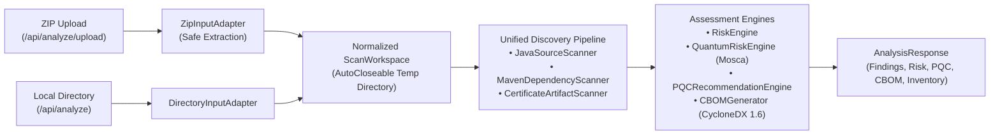
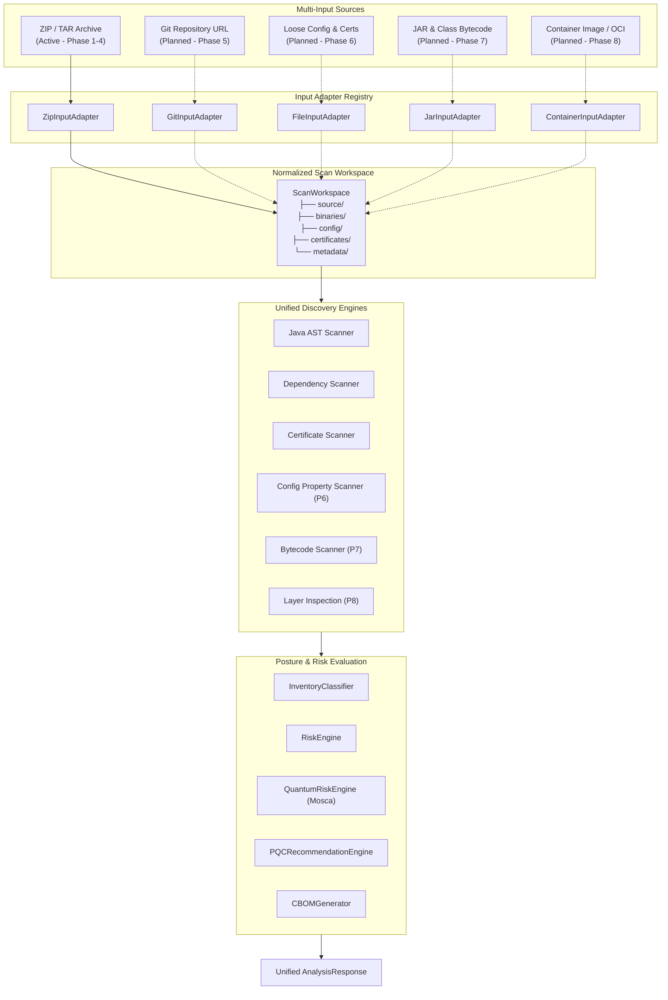

# ECDAT Multi-Input Scan Architecture

## 1. Overview & Objectives

ECDAT (Enterprise Cryptographic Discovery and Assessment Tool) has evolved from a ZIP-only analysis tool into an extensible, multi-input cryptographic posture assessment platform. 

The primary goal of Phase 4 is establishing the **architectural foundation** for multi-input discovery. This ensures future input sources (remote Git repositories, loose binary files, configuration files, compiled bytecode, and container images) seamlessly feed the existing cryptographic discovery, quantum risk evaluation, post-quantum cryptography (PQC) recommendation, and Cryptographic Bill of Materials (CBOM) generation pipelines without requiring invasive rewrites.

---

## 2. Architecture Comparison

### Current Active Pipeline (Phase 1–4)

### Full Multi-Input Target Pipeline (Phases 5–8)

---

## 3. Core Architectural Abstractions

### 3.1 `ScanInputType`
Defines the ingestion mechanism and explicitly marks availability:
- **`ZIP_ARCHIVE`**: Supported (Active)
- **`DIRECTORY`**: Supported (Active, subject to security directory configuration)
- **`GIT_REPOSITORY`**: Planned (Phase 5)
- **`FILES`**: Planned (Phase 6)
- **`JAR`**: Planned (Phase 7)
- **`CLASS`**: Planned (Phase 7)
- **`CONFIGURATION`**: Planned (Phase 6)
- **`CONTAINER_IMAGE`**: Planned (Phase 8)

### 3.2 `AnalysisScope`
Separates **Where we scan** (`ScanInputType`) from **What we analyze** (`AnalysisScope`):
1. `CRYPTO_APIS`: Extract Java AST primitives, algorithms, and key sizes.
2. `DEPENDENCIES`: Resolve build files (`pom.xml`) and identify crypto libraries.
3. `CERTIFICATES`: Parse X.509 public certificates and keystore attributes.
4. `QUANTUM_RISK`: Assess quantum vulnerability using Mosca's Theorem ($X+Y > Z$).
5. `PQC_MIGRATION`: Synthesize NIST FIPS 203/204/205 replacement paths.
6. `CBOM`: Compile CycloneDX 1.6 Cryptographic Bill of Materials.

### 3.3 `ScanRequest`
Unified request contract capturing:
- `inputType`: Selected `ScanInputType`
- `sourceIdentifier`: Source name, filename, path, or URL
- `archiveFile`: Uploaded `MultipartFile` payload
- `context`: `ProjectAnalysisContext` (business criticality, data sensitivity, Mosca timelines)
- `scopes`: Activated `Set<AnalysisScope>`

### 3.4 `ScanWorkspace`
Normalized filesystem abstraction:
- Encapsulates target root directory and standard subpaths (`source/`, `binaries/`, `config/`, `certificates/`, `metadata/`).
- Implements `AutoCloseable`: Guarantees automatic, secure recursive deletion of temporary extraction directories when execution finishes or errors out.

### 3.5 `InputAdapter` & `InputAdapterRegistry`
- `InputAdapter` interface defines `prepareWorkspace(ScanRequest request)`.
- `ZipInputAdapter` extracts archives with Zip Slip checks and resource bounds. **TAR is advertised in the UI as a future archive format; only `.zip` is extracted in Phase 4.**
- `DirectoryInputAdapter` normalizes accessible filesystem paths (existing `/api/analyze` path endpoint, gated by allowed-directory configuration).
- `UnsupportedInputAdapter` strictly rejects planned input types with `UnsupportedInputException`. It never returns an empty or mock `AnalysisResponse`.
- `InputAdapterRegistry` manages adapter discovery and resolution.

`ScanWorkspace` exposes conceptual subpaths (`source/`, `binaries/`, `config/`, `certificates/`, `metadata/`) for later phases. Phase 4 does **not** create those directories unless they already exist in the extracted archive. ZIP extraction writes into the workspace root so existing Java/Maven/certificate scanners behave identically.

---

## 4. Security Architecture

### 4.1 Phase 4 Active Protections
- **Zip Slip Prevention**: Validates every canonical entry path against the normalized target root directory (`!entryDestination.startsWith(targetDir.normalize())`).
- **Archive Entry Limits**: Rejects archives exceeding 10,000 entries.
- **Uncompressed Size Limit**: Enforces a 200MB uncompressed byte limit during streaming decompression.
- **Resource Leak Prevention**: AutoCloseable workspace ensures temp directory cleanup on success or exception.
- **Path Confinement**: Directory scans restricted to configured safe root paths.

### 4.2 Future Phase Security Specifications

#### Phase 5: Git Repository Scanning
- **Allowed URL Schemes**: Restrict to `https://` and authenticated `ssh://`.
- **SSRF Protection**: Block RFC 1918 private IPv4 blocks (`10.0.0.0/8`, `172.16.0.0/12`, `192.168.0.0/16`), loopback (`127.0.0.0/8`), link-local (`169.254.0.0/16`), and AWS/GCP metadata endpoints (`169.254.169.254`).
- **Redirect Validation**: Re-validate destination IP on every HTTP redirect.
- **Clone Safeguards**: Enforce depth limits (`--depth 1`), clone timeouts (e.g. 60s), and maximum repository disk size (e.g. 100MB).

#### Phase 8: Container Image Scanning
- **Layer Limits**: Cap inspected layers (e.g. max 50 layers).
- **Tar Extraction Guards**: Apply full Zip Slip and path containment checks to OCI layer tarballs.
- **Resource Limits**: Impose memory and disk quota limits during layer unpacking.

---

## 5. Implementation Status Matrix

| Component / Feature | Phase | Status | Behavior / Implementation |
|---|:---:|:---:|---|
| **ZIP Archive Upload** | 1–4 | **Implemented** | `ZipInputAdapter` with Zip Slip & bomb limits |
| **Directory Scan** | 1–4 | **Implemented** | `DirectoryInputAdapter` with path confinement |
| **Unified Scan Workspace** | 4 | **Implemented** | `ScanWorkspace` with `AutoCloseable` cleanup |
| **Input Adapter Architecture** | 4 | **Implemented** | `InputAdapter`, `InputAdapterRegistry` |
| **Analysis Scope Model** | 4 | **Implemented** | `AnalysisScope` (6 analytical dimensions) |
| **Frontend Source Cards** | 4 | **Implemented** | ZIP available; Git, Files, Container marked Coming Soon |
| **Git Repository Scanner** | 5 | *Planned* | Explicit rejection with "Phase 5 required" |
| **Configuration Scanner** | 6 | *Planned* | Explicit rejection with "Phase 6 required" |
| **JAR / Bytecode Scanner** | 7 | *Planned* | Explicit rejection with "Phase 7 required" |
| **Container Image Scanner** | 8 | *Planned* | Explicit rejection with "Phase 8 required" |
