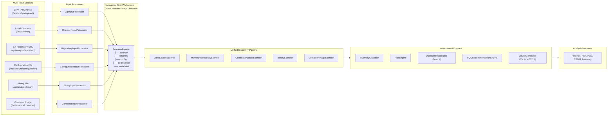

# ECDAT Multi-Input Scan Architecture

## 1. Overview & Objectives

ECDAT (Enterprise Cryptographic Discovery and Assessment Tool) has evolved from a ZIP-only analysis tool into an extensible, multi-input cryptographic posture assessment platform. 

The primary goal of Phase 4-8 was establishing the **architectural foundation** for multi-input discovery. This ensures input sources (remote Git repositories, loose binary files, configuration files, compiled bytecode, and container images) seamlessly feed the existing cryptographic discovery, quantum risk evaluation, post-quantum cryptography (PQC) recommendation, and Cryptographic Bill of Materials (CBOM) generation pipelines.

---

## 2. Architecture Comparison

### Current Active Pipeline (Phase 1–8)

---

## 3. Core Architectural Abstractions

### 3.1 `AnalysisInputType`
Defines the ingestion mechanism and explicitly marks availability:
- **`ZIP_ARCHIVE`**: Supported (Active - Phase 1-4)
- **`DIRECTORY`**: Supported (Active, subject to security directory configuration - Phase 1-4)
- **`REPOSITORY_URL`**: Supported (Active - Phase 5)
- **`SOURCE_FILE`**: Supported (Active - Phase 4)
- **`CONFIGURATION_FILE`**: Supported (Active - Phase 6)
- **`BINARY_FILE`**: Supported (Active - Phase 7)
- **`CONTAINER_IMAGE`**: Supported (Active - Phase 8)

### 3.2 `AnalysisScope`
Separates **Where we scan** (`AnalysisInputType`) from **What we analyze** (`AnalysisScope`):
1. `CRYPTO_APIS`: Extract Java AST primitives, algorithms, and key sizes.
2. `DEPENDENCIES`: Resolve build files (`pom.xml`) and identify crypto libraries.
3. `CERTIFICATES`: Parse X.509 public certificates and keystore attributes.
4. `QUANTUM_RISK`: Assess quantum vulnerability using Mosca's Theorem ($X+Y > Z$).
5. `PQC_MIGRATION`: Synthesize NIST FIPS 203/204/205 replacement paths.
6. `CBOM`: Compile CycloneDX 1.6 Cryptographic Bill of Materials.

### 3.3 `AnalysisInput`
Unified request contract capturing:
- `inputType`: Selected `AnalysisInputType`
- `sourceIdentifier`: Source name, filename, path, or URL
- `archiveFile`: Uploaded `MultipartFile` payload
- `context`: `ProjectAnalysisContext` (business criticality, data sensitivity, Mosca timelines)

### 3.4 `ScanWorkspace`
Normalized filesystem abstraction:
- Encapsulates target root directory and standard subpaths (`source/`, `binaries/`, `config/`, `certificates/`, `metadata/`).
- Implements `AutoCloseable`: Guarantees automatic, secure recursive deletion of temporary extraction directories when execution finishes or errors out.

### 3.5 `AnalysisInputProcessor` & `AnalysisInputProcessorRegistry`
- `AnalysisInputProcessor` interface defines validation and processing methods.
- `ZipInputProcessor` extracts archives with Zip Slip checks and resource bounds.
- `DirectoryInputProcessor` normalizes accessible filesystem paths (existing `/api/analyze` path endpoint, gated by allowed-directory configuration).
- `RepositoryInputProcessor` handles Git repository cloning with SSRF protection.
- `ConfigurationInputProcessor` validates and processes configuration files.
- `BinaryInputProcessor` handles JAR and CLASS file analysis.
- `ContainerInputProcessor` processes Docker/OCI image archives.
- `AnalysisInputProcessorRegistry` manages processor discovery and resolution.

`ScanWorkspace` exposes conceptual subpaths (`source/`, `binaries/`, `config/`, `certificates/`, `metadata/`) for analysis. Extraction writes into the workspace root so existing Java/Maven/certificate scanners behave identically.

---

## 4. Security Architecture

### 4.1 Active Protections
- **Zip Slip Prevention**: Validates every canonical entry path against the normalized target root directory (`!entryDestination.startsWith(targetDir.normalize())`).
- **Archive Entry Limits**: Rejects archives exceeding 10,000 entries.
- **Uncompressed Size Limit**: Enforces a 200MB uncompressed byte limit during streaming decompression.
- **Resource Leak Prevention**: AutoCloseable workspace ensures temp directory cleanup on success or exception.
- **Path Confinement**: Directory scans restricted to configured safe root paths.
- **SSRF Protection**: Blocks RFC 1918 private IPv4 blocks, loopback, link-local, and cloud metadata endpoints.
- **URL Validation**: Enforces HTTPS-only repository URLs, rejects credentials in URLs.
- **Binary Safety**: Static bytecode analysis without execution or class loading.
- **Container Safety**: Static image analysis without Docker daemon or container execution.

### 4.2 Resource Limits
- **Clone Timeout**: 60-second timeout for Git repository cloning.
- **Max Repository Size**: 100MB limit for cloned repositories.
- **Binary File Size**: Configurable limits for JAR/CLASS processing.
- **Container Layer Limits**: Maximum 50 layers per image.
- **Configuration File Size**: 10MB maximum for configuration files.

---

## 5. Implementation Status Matrix

|| Component / Feature | Phase | Status | Behavior / Implementation |
||---|:---:|:---:|---|
|| **ZIP Archive Upload** | 1–4 | **Implemented** | `ZipInputProcessor` with Zip Slip & bomb limits |
|| **Directory Scan** | 1–4 | **Implemented** | `DirectoryInputProcessor` with path confinement |
|| **Unified Scan Workspace** | 4 | **Implemented** | `ScanWorkspace` with `AutoCloseable` cleanup |
|| **Input Processor Architecture** | 4 | **Implemented** | `AnalysisInputProcessor`, `AnalysisInputProcessorRegistry` |
|| **Analysis Scope Model** | 4 | **Implemented** | `AnalysisScope` (6 analytical dimensions) |
|| **Frontend Source Cards** | 4 | **Implemented** | All input types available with proper validation |
|| **Git Repository Scanner** | 5 | **Implemented** | `RepositoryInputProcessor` with SSRF protection |
|| **Configuration Scanner** | 6 | **Implemented** | `ConfigurationInputProcessor` with format validation |
|| **JAR / Bytecode Scanner** | 7 | **Implemented** | `BinaryInputProcessor` with static bytecode analysis |
|| **Container Image Scanner** | 8 | **Implemented** | `ContainerInputProcessor` with static layer analysis |
